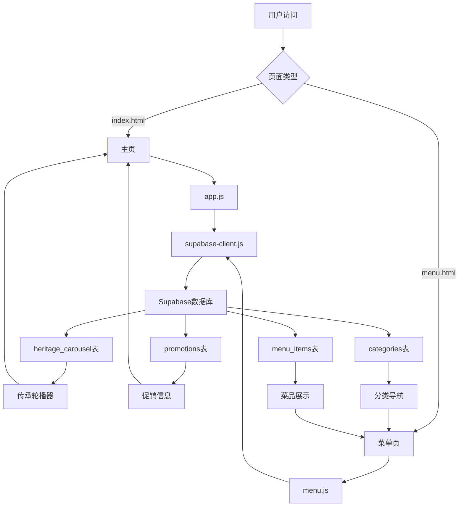

# Westdale Cafe 项目结构总览

## 📁 项目文件组织

```
westdale-cafe-and-eatery/
├── 📄 核心页面
│   ├── index.html                    # 主页（传承轮播器）
│   └── menu.html                     # 菜单页面（分类系统）
│
├── 🎨 前端资源
│   └── js/
│       ├── app.js                    # 主页逻辑（轮播器）
│       ├── menu.js                   # 菜单页面逻辑
│       └── supabase-client.js        # Supabase数据库连接
│
├── ⚙️ 配置文件
│   ├── supabase-config.js            # Supabase配置
│   ├── vite.config.js                # Vite构建配置
│   ├── package.json                  # Node.js依赖
│   └── package-lock.json             # 依赖锁定文件
│
├── 🗄️ 数据库脚本
│   └── database-complete-setup.sql   # 完整数据库初始化
│
└── 📚 文档说明
    ├── README.md                     # 项目说明
    ├── SETUP.md                      # 安装说明
    ├── MENU_UPDATE_GUIDE.md          # 菜单系统指南
    ├── HERITAGE_CAROUSEL_SETUP.md    # 轮播器指南
    ├── DATABASE_INTEGRATION_GUIDE.md # 数据库整合指南
    └── PROJECT_STRUCTURE.md          # 本文件
```

## 🎯 核心功能模块

### 1. 主页功能 (`index.html` + `app.js`)

| 功能 | 描述 | 数据源 |
|------|------|--------|
| **传承轮播器** | 3秒自动切换的图片轮播 | `heritage_carousel` 表 |
| **促销信息** | 动态显示优惠活动 | `promotions` 表 |
| **复古设计** | Vintage风格的视觉效果 | Tailwind CSS + 自定义样式 |

**轮播器特性：**
- ✨ 自动轮播（3秒间隔）
- 🖱️ 鼠标悬停暂停
- 🎯 手动导航（箭头+点击）
- 📱 响应式适配

### 2. 菜单系统 (`menu.html` + `menu.js`)

| 功能 | 描述 | 数据源 |
|------|------|--------|
| **分类选择页** | 显示所有菜单分类卡片 | `categories` 表 |
| **分类专属页** | 每个分类的独立菜品页面 | `menu_items` 表 |
| **动态导航** | 顶部分类切换导航栏 | URL参数路由 |
| **智能显示** | 根据URL参数动态加载内容 | JavaScript路由逻辑 |

**URL路由：**
- `menu.html` → 分类选择页面
- `menu.html?category=1` → 冰饮菜品页面  
- `menu.html?category=2` → 热饮菜品页面
- `menu.html?category=3` → 小食菜品页面

### 3. 数据库架构 (`database-complete-setup.sql`)

| 表名 | 记录数 | 主要用途 | 关联关系 |
|------|--------|----------|----------|
| **categories** | 3个 | 菜单分类管理 | 1→多 menu_items |
| **menu_items** | 21个 | 菜品信息管理 | 多→1 categories |
| **promotions** | 3个 | 促销活动管理 | 独立表 |
| **heritage_carousel** | 3个 | 传承轮播内容 | 独立表 |

## 🔗 数据流架构



## ⚙️ 技术栈

### 前端技术
- **HTML5** - 语义化结构
- **Tailwind CSS** - 响应式样式框架
- **Vanilla JavaScript** - 原生JS，无框架依赖
- **ES6 Modules** - 模块化JavaScript

### 后端服务
- **Supabase** - 数据库即服务
- **PostgreSQL** - 关系型数据库
- **实时API** - 自动生成的REST API

### 开发工具
- **Vite** - 现代构建工具
- **npm** - 包管理器

## 📊 数据管理

### 内容管理方式

| 内容类型 | 管理方式 | 更新频率 | 权限要求 |
|----------|----------|----------|----------|
| **菜品信息** | Supabase表编辑器 | 随时 | 管理员 |
| **分类信息** | Supabase表编辑器 | 较少 | 管理员 |
| **促销活动** | Supabase表编辑器 | 经常 | 管理员 |
| **传承内容** | Supabase表编辑器 | 很少 | 管理员 |

### 图片资源管理

| 图片类型 | 存储方式 | 推荐尺寸 | 格式 |
|----------|----------|----------|------|
| **轮播器背景** | 外部URL（Unsplash） | 800x600px | JPG/WebP |
| **菜品图片** | 外部URL或Supabase Storage | 400x300px | JPG/WebP |
| **图标装饰** | SVG内联 | 矢量 | SVG |

## 🚀 部署架构

### 开发环境
```
本地开发 → Vite Dev Server → Supabase云端数据库
```

### 生产环境
```
用户访问 → CDN/静态托管 → Supabase生产数据库
```

**推荐托管平台：**
- **Vercel** - 自动部署，全球CDN
- **Netlify** - 静态站点托管
- **GitHub Pages** - 免费静态托管

## 🔧 开发工作流

### 1. 环境设置
```bash
# 安装依赖
npm install

# 启动开发服务器
npm run dev
```

### 2. 数据库设置
```sql
-- 在Supabase SQL编辑器中运行
-- 复制粘贴 database-complete-setup.sql 全部内容
```

### 3. 配置Supabase
```javascript
// 更新 supabase-config.js
export const supabaseConfig = {
    url: 'your-supabase-url',
    anonKey: 'your-anon-key'
};
```

### 4. 功能开发
- **主页功能** → 编辑 `app.js`
- **菜单功能** → 编辑 `menu.js`  
- **数据查询** → 编辑 `supabase-client.js`
- **样式调整** → 编辑HTML中的Tailwind类

### 5. 内容管理
- **菜品管理** → Supabase表编辑器
- **图片更换** → 更新数据库中的image_url字段
- **文案修改** → 更新对应表的文本字段

## 📈 性能优化

### 已实现的优化
- ✅ **数据库索引** - 查询性能优化
- ✅ **图片优化** - 使用Unsplash优化过的图片
- ✅ **代码分割** - ES6模块按需加载
- ✅ **缓存策略** - 浏览器缓存静态资源

### 可进一步优化
- 🔄 **图片懒加载** - 提升首屏加载速度
- 🔄 **Service Worker** - 离线访问支持  
- 🔄 **CDN加速** - 全球内容分发
- 🔄 **压缩优化** - Gzip/Brotli压缩

## 🛡️ 安全考虑

### 数据安全
- **行级安全(RLS)** - 可选择启用
- **API密钥管理** - 使用环境变量
- **CORS设置** - 限制跨域访问

### 内容安全
- **输入验证** - 防止SQL注入
- **XSS防护** - 内容转义
- **HTTPS** - 传输加密

## 📞 维护指南

### 日常维护
1. **监控性能** - 检查加载速度
2. **更新内容** - 定期更新菜品和促销
3. **备份数据** - 定期导出数据库
4. **检查链接** - 确保图片链接有效

### 故障处理
1. **检查控制台** - 查看JavaScript错误
2. **验证数据库** - 确认Supabase连接
3. **测试功能** - 验证轮播器和菜单
4. **查看文档** - 参考各种指南文档

---

## 🎉 项目特色

✨ **现代化设计** - 响应式布局，优雅动画
🎠 **动态轮播** - 自动播放的传承故事展示  
🍽️ **智能菜单** - 分类独立页面，便于管理
🗄️ **云端数据** - Supabase驱动的内容管理
📱 **全设备适配** - 手机、平板、桌面完美显示
🎨 **复古风格** - Vintage主题，温馨咖啡馆氛围

这个项目结构清晰、功能完整、易于维护，为Westdale Cafe提供了一个现代化的在线展示平台！ 